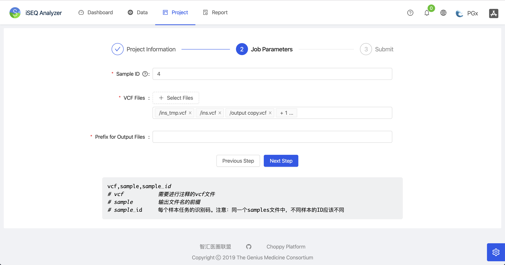
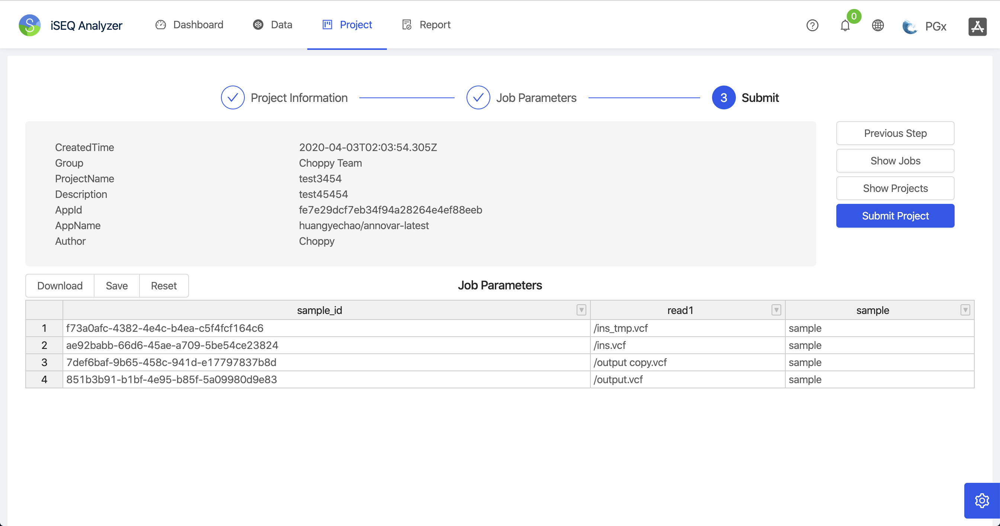
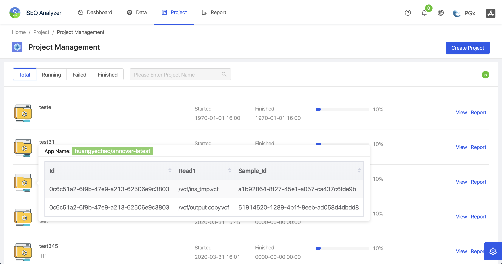
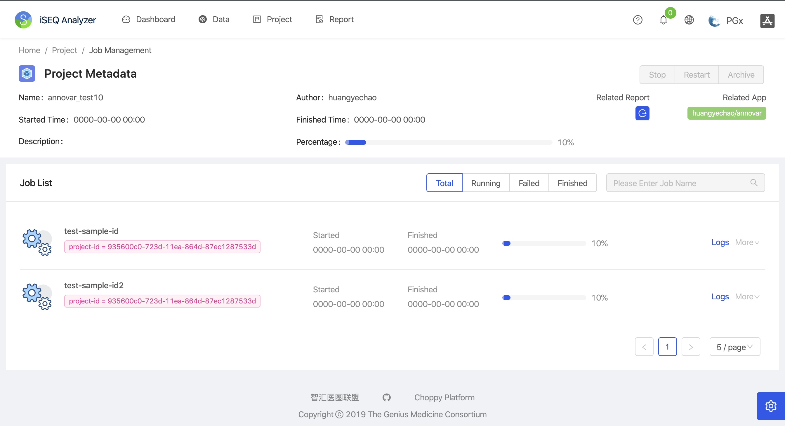
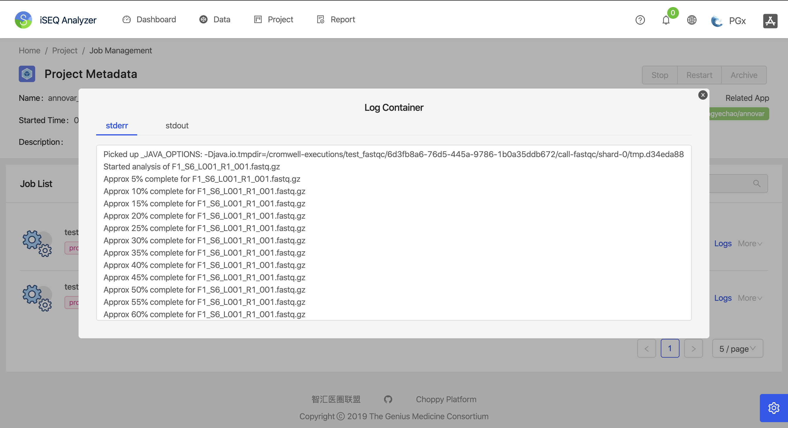
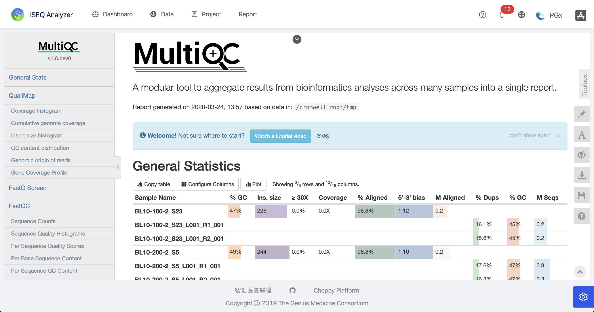
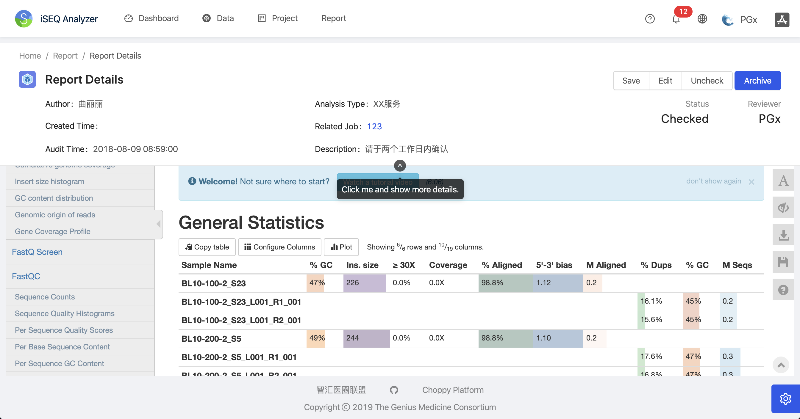

[English](./README.md) | 简体中文

<h1 align="center">iSEQ Analyzer</h1>
<div align="center">
An out-of-box Pipeline Analyzer for sequencing data, e.g. RNA-Seq, WES, WGS etc.

The datains-frontend is a frontend of [datains](https://github.com/go-choppy/datains), but we set it's product name as `iSEQ Analyzer` for matching it's original purpose.
</div>

<div align="center">

[](./LICENSE)

</div>


Overview
----

















环境和依赖
----

- node
- yarn
- webpack
- eslint
- @vue/cli ~3
- [ant-design-vue](https://github.com/vueComponent/ant-design-vue) - Ant Design Of Vue 实现
- [vue-cropper](https://github.com/xyxiao001/vue-cropper) - 头像裁剪组件
- [@antv/g2](https://antv.alipay.com/zh-cn/index.html) - Alipay AntV 数据可视化图表
- [Viser-vue](https://viserjs.github.io/docs.html#/viser/guide/installation)  - antv/g2 封装实现
- [更多依赖](./package.json)

> 请注意，我们强烈建议本项目使用 [Yarn](https://yarnpkg.com/) 包管理工具，这样可以与本项目加载完全相同的依赖版本 (yarn.lock) 。由于我们没有对依赖进行强制的版本控制，采用非 yarn 包管理进行引入时，可能由于所依赖的库已经升级版本而引入了新版本所导致的问题。


项目下载和运行
----

- 拉取项目代码
```bash
git clone https://github.com/clinico-omics/datains-frontend.git
cd datains-frontend
```

- 安装依赖
```
yarn install
```

- 开发模式运行
```
yarn run serve
```

- 编译项目
```
yarn run build
```

- Lints and fixes files
```
yarn run lint
```


## 浏览器兼容

Modern browsers and IE10.

| [](http://godban.github.io/browsers-support-badges/)</br>IE / Edge | [](http://godban.github.io/browsers-support-badges/)</br>Firefox | [](http://godban.github.io/browsers-support-badges/)</br>Chrome | [](http://godban.github.io/browsers-support-badges/)</br>Safari | [](http://godban.github.io/browsers-support-badges/)</br>Opera |
| --- | --- | --- | --- | --- |
| IE10, Edge | last 2 versions | last 2 versions | last 2 versions | last 2 versions |


## 贡献者

[JingchengYang](mailto:yjcyxky@163.com)